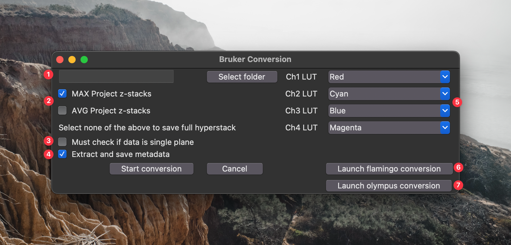

## Bruker to ImageJ Batch Import Workflow

This workflow is designed to batch import files from the four primary microscopes (Bock Confocal, SFC, Olympus FV1000, and the Flamingo) that are used in the Bement Lab. 

If you encounter any issues or have suggestions for additional features, please reach out to Dom Chomchai at [chomchai@wisc.edu](mailto:chomchai@wisc.edu).

### Usage

To use this workflow, follow these steps:

1. Open the `__main__.py` file and run the script.
2. The GUI will default open to the Bruker Conversion:

    1. Select the parent folder path containing a set of images saved from the microscope. This folder must include the raw folders from the microscope. Selecting the path to a single image will not work. Below is an example from a Bruker microscope, showing a folder structure containing 12 separate image folders:  
        

    2. Select the type of z-projection to be performed on the images. Only MAX or AVG projection can be selected at a time. If no projection is selected, full hyperstacks will be saved.

    3. For single-plane Bruker data to be properly processed, ensure this option is checked.

    4. If you want metadata such as frame interval, pixel size, laser powers, etc., to be saved to the final TIFF file and to a CSV file with all the parameters, ensure this option is checked. Note: The Bock Confocal has issues saving metadata for 3-channel movies, so this is likely the only scenario where you might avoid enabling this option.

    5. Select the LUT (Lookup Table) to be saved for each channel. If your image does not include all channels, focus only on the channels that are saved. Images will always be saved in the order of Ch1, Ch2, Ch3, and Ch4. For example, if you used channels 1 and 4 in the Prairie View software, they will be saved as channels 1 and 2 in this program.

    6. Launch the GUI for the Flamingo conversion

    7. Launch the GUI for the Olympus FV1000 conversion

3. The Flamingo conversion GUI will open if selected:

    1. Select the folder path containing a single image saved from the microscope. This folder must contain only a single image saved from the microscope. This program does not currently support processing a set of folders. Below is an example of the expected folder structure for Flamingo microscope data:  
        

    2. Choose the type of z-projection to be performed on the images. Only MAX or AVG projection can be selected at a time. If no projection is selected, full hyperstacks will be saved. **Note:** This could result in very large files if many Z-planes were acquired.

    3. Select the LUT (Lookup Table) to be applied to each channel. If your image does not include all channels, focus only on the channels that are saved. Images will always be saved in the order of Ch1, Ch2, Ch3, and Ch4. For example, if you used channels 1 and 4 in the Prairie View software, they will be saved as channels 1 and 2 in this program.

4. The Olympus FV1000 conversion GUI will open if selected:

    1. Select the parent folder path containing a set of images saved from the microscope. This folder must include the raw folders from the microscope. Selecting the path to a single image will not work. Below is an example from a Olympus microscope, showing a folder structure containing 16 separate image folders:  
        

    2. Choose the type of z-projection to be performed on the images. Only MAX or AVG projection can be selected at a time. If no projection is selected, full hyperstacks will be saved. **Note:** There is no need to specify single-plane data for the FV1000.

    3. Select the LUT (Lookup Table) to be applied to each channel. If your image does not include all channels, focus only on the channels that are saved. Images will always be saved in the order of Ch1, Ch2, Ch3, and Ch4. For example, if you used channels 1 and 4 in the Prairie View software, they will be saved as channels 1 and 2 in this program.

5. For all of the GUIs, press "Start Conversion" to start the script, or click "Cancel" to close the GUI.